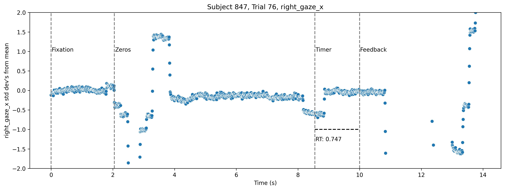
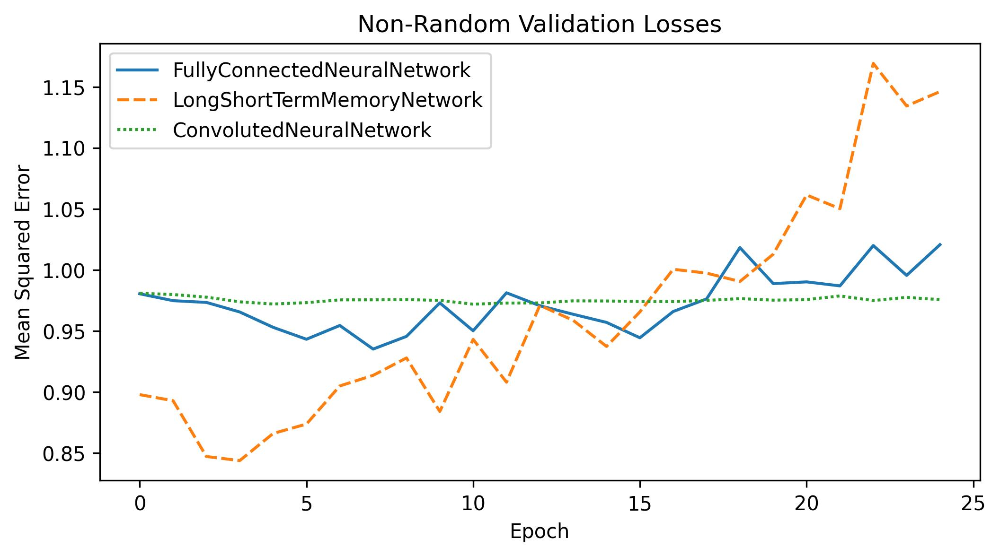

# Predicting Reaction Times from Pupilometry Data
-----------------
## Introduction  
This project uses pupilometry data to predict reaction times.  

-----------------
## Objective
The objective of this project is to predict reaction times from pupilometry data.  

-----------------
## Data

(information about where the data came from, how it was collected, etc.)

The data is a set of trials. Each trial has 6 features and a reaction time, features are sampled every 8-10 milliseconds. The reaction time is the time between the onset of the stimulus and the button press.

Sample features:  
1. Right Pupil Diameter (right pupil)
2. Left Pupil Diameter (left pupil)
3. Right Eye Position X (right_gaze_x)
4. Right Eye Position Y (right_gaze_y)
5. Left Eye Position X (left_gaze_x)
6. Left Eye Position Y (left_gaze_y) 

Here is a sample of the data:

  

-----------------
## Methods
The data is split into training and testing data. The training data is used to train the models. The testing data is used to test the models.  
The data is processed in the following way:  
  
1. The data is split into training and testing data.
2. Each feature of the data and the labels are standardized.
3. Nan heavy trials are removed. (Trials with more than 40% of the data missing on average and more than 60% of the data missing in any feature.)
4. Remaining Nan values are filled with the an interpolation of the previous and next values.
4. The data is processed into a 2D matrix of trials. Each row is a feature. Each column is a trial. The last 200 samples of each trial are used.
5. 4 models are trained and used to predict reaction times.  
  
Here is a sample of the processed data:  
  


-----------------
## Results and Conclusion  
4 models were used to predict reaction times. Each model takes all pupilometry features. The Testing Data loss (Mean Average Error) is taken from each model.  

  

The results show that the fully connected neural network and the long short-term memory network perform the best. The convolutional neural network performs the worst. The random baseline performs as expected. 
  
  

The results show progress in predicting reaction times from pupilometry data. The quick overfitting of the data shows that either the models or the training data are not sufficient to predict reaction times.  
Moving forward, more data should be collected and more models should be tested.

-----------------
## Repository
```
Project Structure:
├── code/ (this repository)
│   ├── data/
│       ├── processing/
│           ├── processData.py
│           ├── processData.ipynb
│       ├── visualizations/
│           ├── visualizations.py
│           ├── visualizations.ipynb
│       ├── nanHandling/
│           ├── nanHandling.py
│           ├── nanHandling.ipynb
│       ├── fullprocess.ipynb
│       ├── fullprocess.py
│   ├── models/
│       ├── RandomBaseline.py
│       ├── FullyConnectedNeuralNetwork.py
│       ├── ConvolutedNeuralNetwork.py
│       ├── LongShortTermMemoryNetwork.py
│       ├── TrainingAndTesting.ipynb
│   ├── extra/ <- supporting files for github repo
│   ├── readme.md
├── fulldata/
│   ├── raw/
│       ├── rawEyePupilometryData.csv
│       ├── subjectInfo.csv
│   ├── processed/
│       ├── processedData.pkl
│       ├── processedSubjectInfo.pkl
│       ├── TrainingData.pkl
│       ├── TrainingSubjectInfo.pkl
│       ├── TestingData.pkl
│       ├── TestingSubjectInfo.pkl
```

### Code (This Repository)

### Data:

### Processing

Notebooks for inital processing of the data.

### Visualization

Notebooks for visualizing the data.  
Includes tools for visually analyzing the features for individual trials and statistics for the features across all trials in the "Zeros" Phase.


### Nan Handling

Notebooks for handling Nan values in the data.
3 methods are used to handle Nan values.

1. Global Average: The Nan values are replaced with the average of the feature across all trials.
2. Local Average: The Nan values are replaced with the average of the feature across the trial.
3. Interpolation: The Nan values are replaced with an interpolation of the previous and next values.

### Models
5 models were used to predict reaction times. Each model takes all pupilometry features. The models are listed below.

**Model 1: Random Baseline**  
-> In this model, we randomly assign a reaction time to each trial. The reaction time is randomly selected from the distribution of reaction times in the data.

**Model 2: Full Connected Neural Network**  
-> In this model, we use a fully connected neural network to predict reaction times. The input is a vector of concatenated features.

**Model 3: Convoluted Neural Network**  
-> In this model, we use a convolutional neural network to predict reaction times. The input is a heatmap of concatenated features shaped Features x Window Length.

**Model 4: Long Short-Term Memory Network**  
-> In this model, we use a long short-term memory network to predict reaction times. The input is the time series of each feature.

### Full Data
This is the full data used in the project. The data is split into raw data and processed data.  
The Data is 3.0GB.

-----------------
